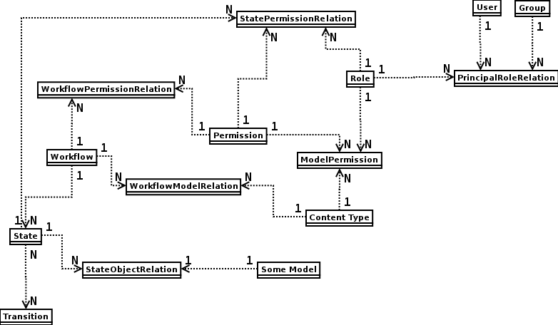

=============================
Workflow & Permission system
=============================

.. contents::

-------------------
General Information
-------------------

Workflow subsystem is independent of installed apps, so it can be separated as isolated app.
Model-level support is implemented so far, object-level is in TODO list.

Short description of workflow/permission classes follows. Classes dependency is visualized in a
`class diagram`_.

Class diagram
=============

.. _`class diagram`:

|dia_workflow|

Workflow models
===============
``Workflow`` is made of directed graph, nodes are modelled by ``State`` instances
and edges are modelled by ``Transition`` instances.

**Workflow** model - Workflow instance can be added to any model:

 ::

    from ella_hub.model import Workflow, CommonArticle

    wf = Workflow(title="My epic workflow")
    wf.set_to_model(CommonArticle)

**State** model

 ::

    state = State("Epic out-of-space state")
    state.workflow = workflow

**Transition** model - transitions are connections between nodes (states), you can add more transitions to one state ofc.:

 ::

    from ella_hub.models import State, Transition

    init_state = State("Init state")
    edited_state = State("Edited state")
    finished_state = State("Finished state")

    init = Transition(title="To init", destination=init_state)
    edited = Transition(title="To edited", destination=edited_state)
    finished = Transition(title="To finished", destination=finished_state)

    # now we can f.e. make  a complete graph
    init_state.transitions.add(edited_state)
    init_state.transitions.add(finished_state)

    edited_state.transitions.add(init_state)
    edited_state.transitions.add(finished_state)

    finished_state.transitions.add(init_state)
    finished_state.transitions.add(edited_state)

*StatePermissionRelation* - is mapping permission for a given state to a given role, f.e. role "Editor in chief"
can in state "Corrected" publish an article (has "can_publish" permission):

 ::

    from ella_hub.models import Permission, State, Role, StatePermissionRelation

    corr_state = State(title="Corrected state")
    can_publish = Permission(titile="Can publish", codename="can_publish")
    editor_in_chief = Role(title="Editor in chief")

    relation = StatePermissionRelation(state=corr_state, permission=can_publish, role=editor_in_chief)

*StateObjectRelation* - is mapping a given state to a given model object:

 ::

    from ella_hub.models import State, StateObjectRelation, CommonArticle
    from django.contrib.contenttypes.models import ContentType

    state = State(title="Some state")
    ct = ContentType.objects.get_for_model(CommonArticle)
    article = CommonArticle(title="Awesome article", ...)
    relation = StateObjectRelation(state=state, content_type=ct, content_id=article.id)

*WorkflowPermissionRelation* - is mapping a given permission to a given workflow, permissions
could be implemented as ManyToMany attribute in Workflow model, but we'd lost Workflow and Permission
system independency.

 ::

    from ella_hub.models import Workflow, Permission, WorkflowPermissionRelation

    wf = Workflow(title="Epic workflow")
    can_publish = Permission(title="Can publish", codename="can_publish")
    relation = WorkflowPermissionRelation(permission=can_publish, workflow=wf)

Permission models
=================

**Permission** model - defines a permission, f.e.:

 ::

    from ella_hub.models import Permission

    can_live = Permission(title="Can live", codename="can_live", description="Quite important right.")

**Role** model - defines a role, f.e.:

 ::

    from ella_hub.models import Role

    editor_in_chief = Role(title="Editor in chief", description="Got all rights worldwide.")

*ModelPermission* - is mapping a given role to permission for a given model content_type:

 ::

    from ella_hub.models import Role, Permission, ModelPermission, Photo
    from django.contrib.contenttypes.models import ContentType

    ct = ContentType.objects.get_for_model(Photo)

    photographer = Role(title="Photographer")
    can_add = Permission(title="Can add", codename="can_add")
    mp = ModelPermission(role=photographer, permission=can_add, content_type=ct)

*PrincipalRoleRelation* - is mapping a given role to a principal (group/user):

 ::

    from ella_hub.models import Role, PrincipalRoleRelation
    from django.contrib.auth.models import User, Group

    editor = Role(title="Editor")
    userko = User(username="Userko")
    relation = PrincipalRoleRelation(role=editor)
    relation.set_principal(userko)

-------------
Ella workflow
-------------

States
==================

* added - Added/Vložen
* ready - Ready/Připraven
* approved - Approved/Schválen
* published - Published/Publikován
* postponed - Postponed/Odložen
* deleted - Deleted/Smazán

Testing Ella-workflow implementation
====================================
*TODO*
